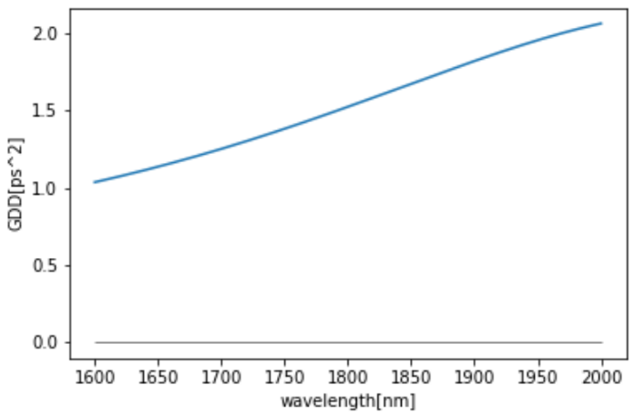
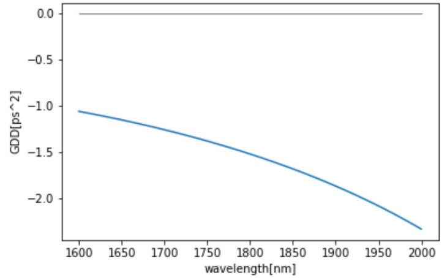
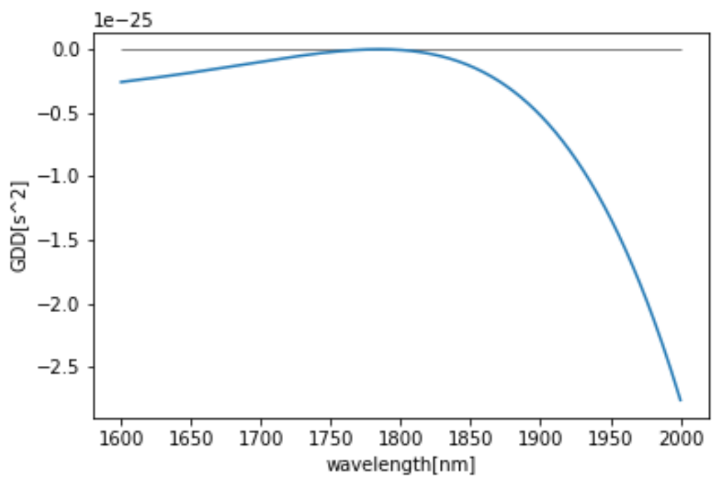
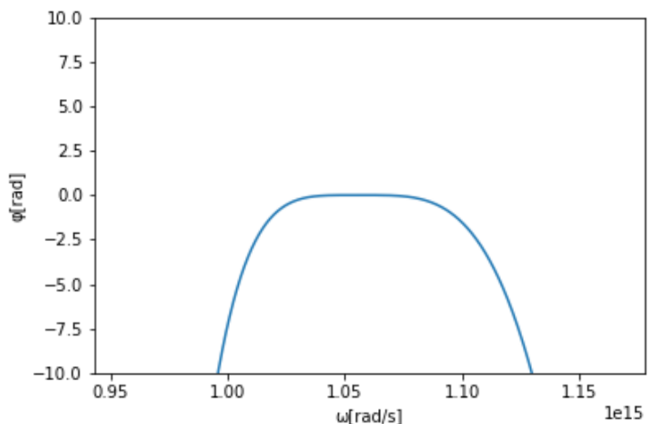
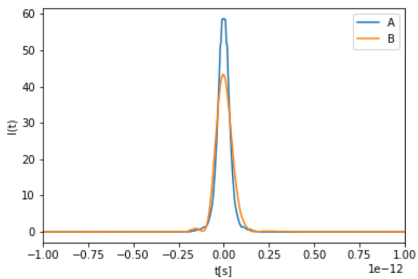

# grism

"grism"は，グリズム対設計を高速に行うための最適値探索ツールです．

# DEMO

"grism"では，グリズム対の設計のための最適値探索や最適値探索後の群遅延分散（GDD：Group Delay Dispersion）・位相・パルス幅のシミュレーションなどができます．

さらに，グリズム対設計に伴う，伸長器のGDD算出やグリズム対のGDD算出などもできます．

以下に各出力結果の例を示します．

**伸長器のGDD**

**グリズム対のGDD**

**伸長器とグリズム対のGDDの和**

**GDDから位相表示**

**位相からパルス幅表示**

# Features

"grism"では，以下のような特徴があります．

* 数十万通りのパラメータの組み合わせから最適な各パラメータを数分で探索可能
* 最適値を用いたシミュレーションが可能（位相やパルス形状）
* 探索に必要な情報についても算出可能（ストレッチャーの光学特性からGDDを算出）
* シミュレーション結果を画像と自動的に保存可能

# Usage

"grism"の使い方は以下の通りです．

1. 伸長器のGDDを光学特性から計算（calculate fiber GDD　以下）
2. 4変数による，グリズム対のGDDの式を定義（grism pair design　以下）
3. 最適値探索（optomal value search　以下）
4. シミュレーション（simulation result　以下）

# Author

* 作成者：岡田海門
* 所属：豊田工業大学大学院　工学研究科　先端工学専攻　レーザ科学研究室
* E-mail：sd22405@tti-j.net
